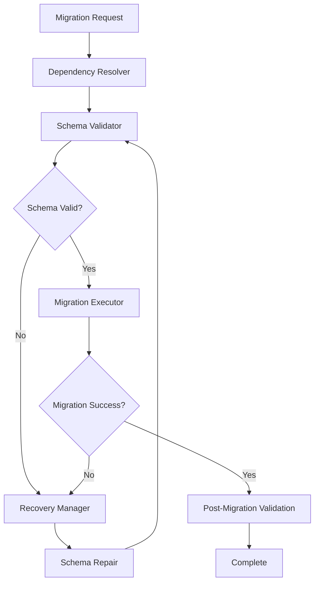

# Design Document

## Overview

The database migration system is currently failing due to circular dependencies and missing column references. The core issue is that migration `0001_core_tables_idempotent.sql` attempts to create indexes and constraints on columns that don't exist yet, specifically the `project_id` column in various tables. This creates a chicken-and-egg problem where the migration can't complete, preventing the application from starting.

The solution involves implementing a robust migration dependency resolution system, schema validation, and recovery mechanisms to handle partial migration states gracefully.

## Architecture

The migration fix system consists of four main components:

1. **Migration Dependency Resolver** - Analyzes migration files to determine execution order
2. **Schema Validator** - Validates database state before and after migrations
3. **Recovery Manager** - Handles failed migration states and provides repair options
4. **Migration Executor** - Enhanced migration runner with better error handling



## Components and Interfaces

### Migration Dependency Resolver

**Purpose**: Analyzes SQL migration files to identify dependencies and determine safe execution order.

**Interface**:
```typescript
interface MigrationDependencyResolver {
  analyzeMigrations(migrationFiles: MigrationFile[]): DependencyGraph;
  resolveDependencies(graph: DependencyGraph): MigrationFile[];
  validateDependencies(migrations: MigrationFile[]): ValidationResult;
}

interface MigrationFile {
  filename: string;
  content: string;
  checksum: string;
  dependencies: string[];
  creates: string[];
  references: string[];
}
```

**Key Features**:
- Parses SQL to extract table/column references
- Builds dependency graph based on CREATE/ALTER/INDEX operations
- Detects circular dependencies
- Provides safe execution order

### Schema Validator

**Purpose**: Validates database schema state and ensures consistency with application expectations.

**Interface**:
```typescript
interface SchemaValidator {
  validateCurrentSchema(): SchemaValidationResult;
  validateMigrationPrerequisites(migration: MigrationFile): ValidationResult;
  validatePostMigration(migration: MigrationFile): ValidationResult;
  generateSchemaReport(): SchemaReport;
}

interface SchemaValidationResult {
  isValid: boolean;
  missingTables: string[];
  missingColumns: ColumnReference[];
  invalidConstraints: string[];
  recommendations: string[];
}
```

**Key Features**:
- Checks for missing tables and columns
- Validates foreign key relationships
- Identifies orphaned indexes
- Provides detailed error reporting

### Recovery Manager

**Purpose**: Handles failed migration states and provides automated repair options.

**Interface**:
```typescript
interface RecoveryManager {
  detectFailureState(): FailureState;
  generateRecoveryPlan(failure: FailureState): RecoveryPlan;
  executeRecovery(plan: RecoveryPlan): RecoveryResult;
  rollbackMigration(migration: MigrationFile): RollbackResult;
}

interface RecoveryPlan {
  actions: RecoveryAction[];
  riskLevel: 'low' | 'medium' | 'high';
  dataLossRisk: boolean;
  estimatedTime: number;
}
```

**Key Features**:
- Detects partial migration states
- Creates missing columns/tables
- Repairs broken constraints
- Provides rollback capabilities

### Enhanced Migration Executor

**Purpose**: Executes migrations with improved error handling and recovery capabilities.

**Interface**:
```typescript
interface EnhancedMigrationExecutor {
  executeMigration(migration: MigrationFile): ExecutionResult;
  executeWithRecovery(migration: MigrationFile): ExecutionResult;
  validateExecution(migration: MigrationFile): ValidationResult;
  getExecutionStatus(): ExecutionStatus;
}
```

**Key Features**:
- Transactional execution with rollback
- Detailed progress reporting
- Automatic retry with exponential backoff
- Schema validation at each step

## Data Models

### Migration Tracking

```sql
CREATE TABLE schema_migrations (
    id SERIAL PRIMARY KEY,
    filename VARCHAR NOT NULL UNIQUE,
    executed_at TIMESTAMP DEFAULT NOW(),
    checksum VARCHAR NOT NULL,
    execution_time_ms INTEGER,
    status VARCHAR DEFAULT 'completed',
    error_message TEXT,
    recovery_attempts INTEGER DEFAULT 0,
    metadata JSONB
);
```

### Schema Validation Log

```sql
CREATE TABLE schema_validation_log (
    id SERIAL PRIMARY KEY,
    validation_type VARCHAR NOT NULL,
    status VARCHAR NOT NULL,
    issues_found INTEGER DEFAULT 0,
    issues_resolved INTEGER DEFAULT 0,
    validation_data JSONB,
    created_at TIMESTAMP DEFAULT NOW()
);
```

### Migration Dependencies

```sql
CREATE TABLE migration_dependencies (
    id SERIAL PRIMARY KEY,
    migration_filename VARCHAR NOT NULL,
    depends_on VARCHAR NOT NULL,
    dependency_type VARCHAR NOT NULL,
    created_at TIMESTAMP DEFAULT NOW(),
    UNIQUE(migration_filename, depends_on)
);
```

## Correctness Properties

*A property is a characteristic or behavior that should hold true across all valid executions of a system-essentially, a formal statement about what the system should do. Properties serve as the bridge between human-readable specifications and machine-verifiable correctness guarantees.*

Now I'll analyze the acceptance criteria to determine which ones can be tested as properties:

### Property 1: Migration Dependency Resolution
*For any* set of migration files with dependencies, the migration system should execute them in an order where all dependencies are satisfied before dependent operations
**Validates: Requirements 1.1, 1.2**

### Property 2: Column Reference Validation
*For any* migration operation that references a database column, the system should validate that the column exists before attempting the operation
**Validates: Requirements 1.2, 2.1, 2.2, 2.3**

### Property 3: Error Handling Consistency
*For any* migration failure or invalid operation, the system should provide clear error messages and log the issue with sufficient context for debugging
**Validates: Requirements 1.3, 2.4, 5.2**

### Property 4: Migration State Tracking
*For any* migration execution (successful or failed), the system should accurately record the state in the tracking table and provide correct status information
**Validates: Requirements 3.1, 3.2, 5.3**

### Property 5: Schema Recovery and Repair
*For any* detected schema inconsistency, the system should provide viable repair options and execute them safely without data loss
**Validates: Requirements 3.3, 3.4**

### Property 6: Schema Completeness Validation
*For any* application startup, the final database schema should contain all required tables, columns, indexes, and constraints needed by the application
**Validates: Requirements 4.1, 4.2, 4.3, 4.4**

### Property 7: Migration Idempotency
*For any* migration operation, running it multiple times should produce the same result without errors or data corruption
**Validates: Requirements 6.2, 6.3**

### Property 8: Production Safety Guarantees
*For any* production environment execution, the migration system should use advisory locks, preserve existing data, and validate constraints before applying changes
**Validates: Requirements 6.1, 6.3, 6.4**

## Error Handling

The system implements comprehensive error handling at multiple levels:

### Migration-Level Errors
- **Syntax Errors**: SQL parsing failures with line-by-line error reporting
- **Dependency Errors**: Missing table/column references with suggested fixes
- **Constraint Violations**: Data compatibility issues with repair recommendations
- **Timeout Errors**: Long-running operations with progress tracking

### System-Level Errors
- **Connection Failures**: Database connectivity issues with retry logic
- **Lock Acquisition Failures**: Advisory lock conflicts with queuing mechanism
- **Resource Exhaustion**: Memory/disk space issues with graceful degradation
- **Concurrent Access**: Multiple migration attempts with coordination

### Recovery Strategies
- **Automatic Retry**: Exponential backoff for transient failures
- **Manual Intervention**: Clear instructions for complex issues
- **Rollback Capability**: Safe reversion to previous schema state
- **Partial Recovery**: Completion of partially executed migrations

## Testing Strategy

The testing approach uses both unit tests and property-based tests to ensure comprehensive coverage:

### Unit Testing Focus
- **Specific Error Scenarios**: Test known problematic migration patterns
- **Edge Cases**: Empty databases, corrupted migration files, network failures
- **Integration Points**: Database connection handling, file system operations
- **Recovery Procedures**: Specific rollback and repair scenarios

### Property-Based Testing Focus
- **Migration Dependency Resolution**: Generate random migration sets with various dependency patterns
- **Schema Validation**: Generate random schema states and verify validation accuracy
- **Error Handling**: Generate various failure scenarios and verify consistent error handling
- **Idempotency**: Run operations multiple times and verify consistent results
- **Data Preservation**: Apply schema changes to databases with random data and verify no data loss

### Test Configuration
- **Minimum 100 iterations** per property test to ensure comprehensive input coverage
- **Database Isolation**: Each test uses a separate database instance to prevent interference
- **Migration Simulation**: Tests use realistic migration files based on actual application needs
- **Performance Validation**: Tests include timing constraints for production-acceptable performance

### Property Test Tags
Each property test will be tagged with:
- **Feature: database-migration-fix, Property 1**: Migration dependency resolution testing
- **Feature: database-migration-fix, Property 2**: Column reference validation testing
- **Feature: database-migration-fix, Property 3**: Error handling consistency testing
- **Feature: database-migration-fix, Property 4**: Migration state tracking testing
- **Feature: database-migration-fix, Property 5**: Schema recovery and repair testing
- **Feature: database-migration-fix, Property 6**: Schema completeness validation testing
- **Feature: database-migration-fix, Property 7**: Migration idempotency testing
- **Feature: database-migration-fix, Property 8**: Production safety guarantees testing